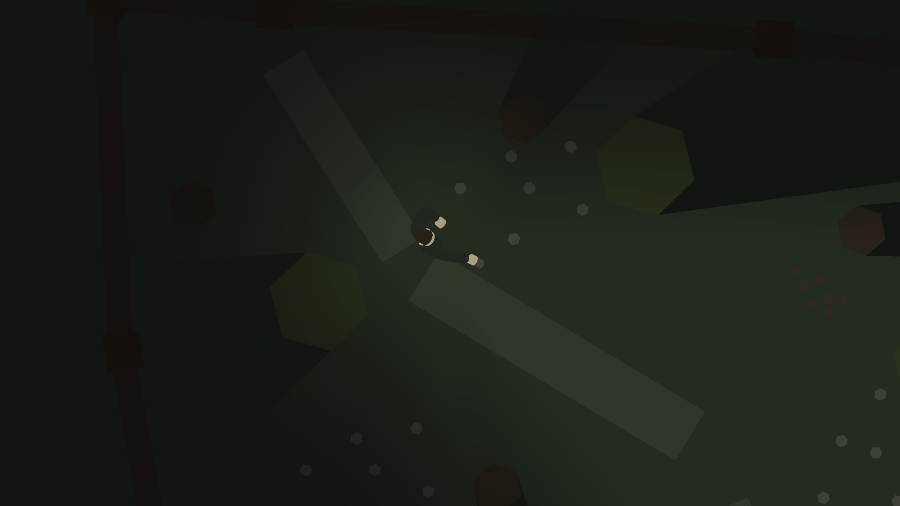

# 2D Stranger Things-Inspired Game – School Project

This is a 2D game made in Unity, inspired by the world and atmosphere of *Stranger Things*. It blends light action with exploration and mystery.

## Overview

You play as a person trying to uncover what happened in an abandoned facility left behind in the woods. The forest surrounding the facility is crawling with demogorgons, and you’ll need to stay sharp to survive.

The story unfolds as you explore the ruins, find clues, and push further into the unknown — both in the real world and in the upside down.

---

